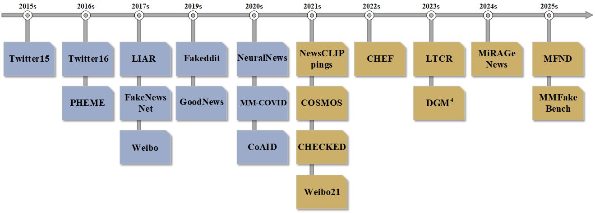

# review

 
  

### Popular Benchmark Data
| Dataset | Year | Link | Methods | Year | Link|
| :----: | :----: | :----: | :----: | :----: | :----: |
| Twitter15 | 2015 | [[Link]](https://github.com/majingCUHK/Rumor_RvNN?tab=readme-ov-file) | Twitter16  | 2016 | [[Link]](https://github.com/majingCUHK/Rumor_RvNN?tab=readme-ov-file) | 
| PHEME | 2016 | [[code]](https://www.kaggle.com/datasets/usharengaraju/pheme-dataset) | LIAR | 2017 | [[Link]](https://www.kaggle.com/datasets/yuktibishambu/liar-dataset-labeled) |
| FakeNewsNet | 2017 | [[Link]](https://github.com/KaiDMML/FakeNewsNet) | Weibo | 2017 | [[Link]](https://github.com/plw-study/MRML?tab=readme-ov-file) |
| Fakeddit | 2019 | [[Link]](https://github.com/entitize/fakeddit) | GoodNews | 2019 | [[Link]](https://github.com/furkanbiten/GoodNews) |
| NeuralNews | 2020 | [[Link]](https://drive.google.com/file/d/1vD4DtyJOIjRzchPtCQu-KPrUjgTiWSmo/view) | MM-COVID | 2020 | [[Link]](https://drive.google.com/drive/folders/1gd4AvT6BxPRtymmNd9Z7ukyaVhae5s7U) |
| CoAID | 2020 | [[Link]](https://github.com/cuilimeng/CoAID) | NewsCLIPpings | 2021 | [[Link]](https://github.com/g-luo/news_clippings?tab=readme-ov-file) |
| COSMOS | 2021 | [[Link]](https://shivangi-aneja.github.io/projects/cosmos/) |  CHECKED | 2021 | [[Link]](https://github.com/cyang03/CHECKED/tree/master/dataset) |
| Weibo21 | 2021| [[2021]](https://github.com/kennqiang/MDFEND-Weibo21) | CHEF | 2022 | [[Link]](https://github.com/THU-BPM/CHEF?tab=readme-ov-file) |
| LTCR | 2023 | [[Link]](https://github.com/Enderfga/DoubleCheck/blob/main/data/LTCR.csv) | DGM4 | 2023 | [[Link]](https://huggingface.co/datasets/rshaojimmy/DGM4) |
| MiRAGeNews | 2024 | [[Link]](https://huggingface.co/datasets/anson-huang/mirage-news) | MMFakeBench | 2025 | [[Link]](https://huggingface.co/datasets/liuxuannan/MMFakeBench) |
| MFND | 2025 | [[Link]](https://github.com/yunan-wang33/sdml) | - | - | - |
